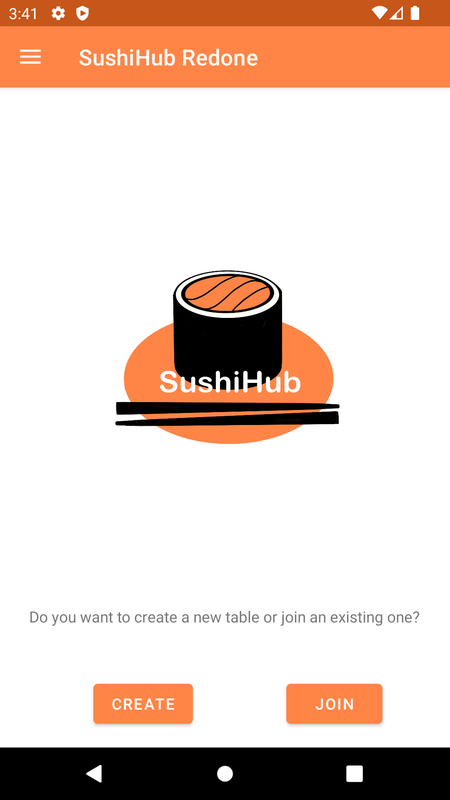
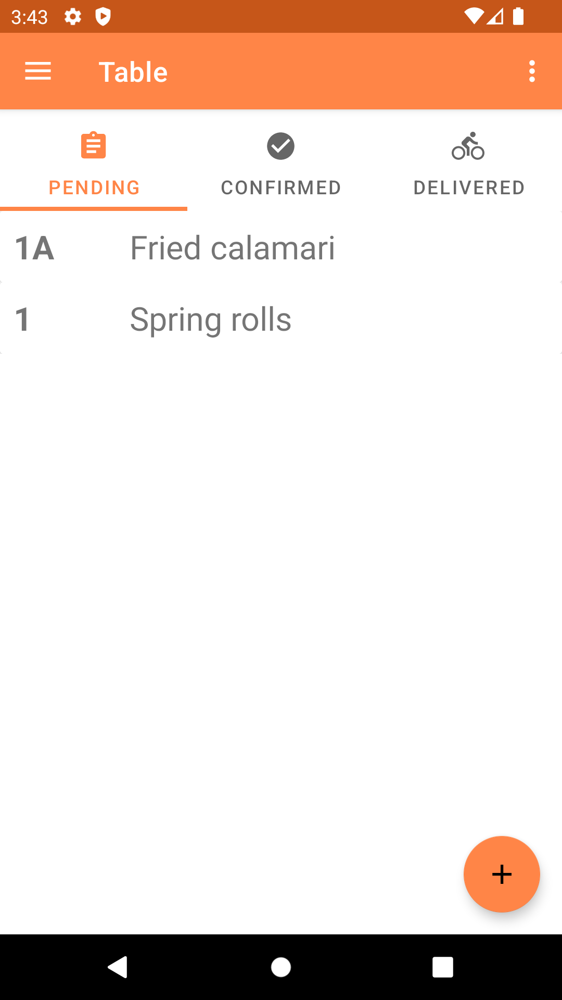
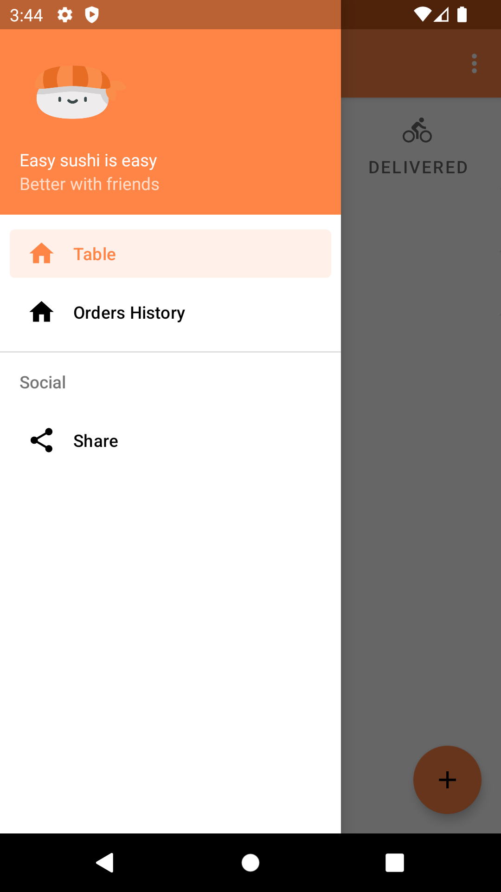

# SushiHub Redone
 
This is a Kotlin version of my Software Engineering project [SushiHub](https://github.com/owsky/SushiHub), developed while attending the University of Venice. The goal was to formulate an idea for an Android application and bring it to fruition from scratch.

The purpose of this app is to facilitate the ordering process at a 'All-you-can-eat' restaurant by enabling P2P communication between the user's devices. This lets the users sync all their orders to one device, which will be shown to the waiter for the actual ordering. Communication is handled by the Nearby API, thus it requires WiFi and Bluetooth to exchange data.

  
  
  

To develop this app I applied the single activity architecture and MVVM + Repository pattern. I also implemented dependency injection through Hilt.
